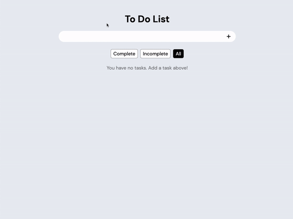
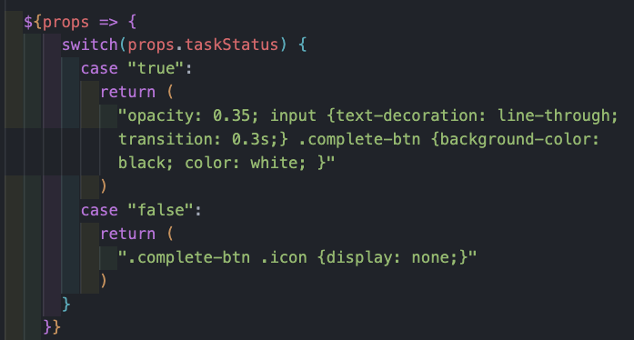

# To Do List

## About
A simple and intuitive checklist app made with React.  
[Click here](https://leifaj.github.io/to-do/) to view the live site.

## How It's Made
**Tech used:** HTML, CSS, JavaScript, React

## Lessons Learned
- **Using Styled Components:** This is my first time trying out CSS-in-JS, and I used [styled components](https://styled-components.com/) for this app. 
I liked adding organized styles directly to a React component and being able to change styles based on state/props. 
For example, different styles were applied to a task based on its completion status (see [Task.styled.js](https://github.com/leifaj/to-do/blob/main/src/components/Task/Task.styled.js)):

## Roadmap
- [x] Save tasks in local storage
- [x] Prevent creation of empty tasks
- [x] Put new tasks on the top of the list
- [x] Make tasks editable
- [x] Apply styles based on completion status (e.g. checkmark display, line-through text, lower opacity)
- [x] Create media queries for responsiveness
- [x] Display message if there are no tasks
- [ ] Implement light/dark mode
